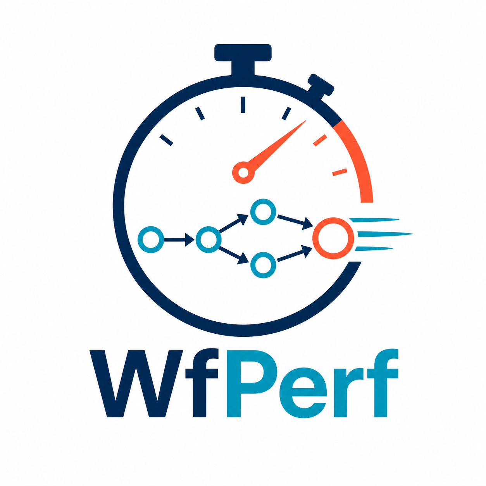

<p align="center">
  
</p>

<h1 align="center">WfPerf: A Workflow Performance Benchmark for Distributed and In Situ HPC/AI Systems</h1>

<p align="center">
  <a href="https://iiswc.org/iiswc2026/program.html"><strong>Paper</strong></a>
</p>

WfPerf is a characterization-oriented benchmark that constructs configurable
workflows from source, intermediate, and sink tasks, then reports task
execution, I/O, and end-to-end timing.

WfPerf supports [Wilkins](https://github.com/orcunyildiz/wilkins) and
[Parsl](https://parsl-project.org/) as alternative workflow execution
backends. Users select a backend for each run; both consume the same YAML
workflow description and produce the same result schema.

## Table of Contents

- [Overview](#overview)
- [Repository Structure](#repository-structure)
- [Requirements](#requirements)
- [Installation](#installation)
- [Quick Start](#quick-start)
- [Workflow Configuration](#workflow-configuration)
- [Running WfPerf](#running-wfperf)
  - [Backend Selection](#backend-selection)
  - [Parsl Backend](#parsl-backend)
  - [Wilkins Backend](#wilkins-backend)
- [Results](#results)
- [Testing](#testing)
- [Acknowledgments](#acknowledgments)
- [License](#license)

## Overview

A WfPerf workflow has three kinds of stages:

```text
source task(s) -> zero or more intermediate stage(s) -> sink task(s)
```

- **Source tasks** emulate computation and generate HDF5 particle data.
- **Intermediate tasks** consume assigned upstream files, emulate computation,
  and generate new HDF5 particle data.
- **Sink tasks** consume the final HDF5 files and emulate downstream
  computation.

Task counts can change between stages. WfPerf supports both fan-in and fan-out:
upstream outputs are divided evenly for fan-in and assigned round-robin for
fan-out. The common dataset is `/group1/particles`, with three floating-point
coordinates per particle.

The benchmark definition is backend-neutral. Wilkins executes the stages as
MPI/Henson modules with LowFive in situ data movement. Parsl expresses the same
stage dependencies with file futures. Scheduler, queue, allocation, and
machine settings remain outside the benchmark source for both backends.

## Repository Structure

```text
WfPerf/
├── examples/                       # Public example configurations
│   └── benchmark.yaml              # Example benchmark workflow
├── ml/                             # Workflow characterization and modeling
├── spack/                          # Custom Spack package repository
├── src/wfperf/
│   ├── config.py                   # Shared YAML parser and validation
│   ├── ml/                         # Training, data storage, and inference
│   └── backends/
│       ├── parsl/                  # Parsl backend adapter and tasks
│       └── wilkins/                # Wilkins adapter and WfPerf modules
│           └── native/             # WfPerf C++/MPI/HDF5 workflow blocks
├── tests/                          # Unit and integration tests
└── pyproject.toml                  # Python package metadata
```

## Requirements

All installations require Python 3.8 or newer and PyYAML 6.0 or newer.
Optional component requirements are:

| Backend | Additional requirements |
| --- | --- |
| Parsl | Parsl 2024.4.8+, h5py 3.8+, and NumPy 1.23+ |
| Wilkins | MPI, parallel HDF5, mpi4py, an external Wilkins installation, LowFive, Henson, DIY, and CMake |
| Performance model | scikit-learn 1.2+, NumPy 1.23+, and joblib 1.2+ |

Dependencies are declared as optional extras in `pyproject.toml` and as
variants in the custom [Spack repository](spack/README.md).

## Installation

Clone the repository, create a virtual environment, and install WfPerf:

```bash
git clone <repository-url>
cd WfPerf

python3 -m venv .venv
source .venv/bin/activate
python -m pip install --upgrade pip
python -m pip install -e .
```

Install the extra for the backend or backends you want to use:

```bash
# Parsl dependencies
python -m pip install -e '.[parsl]'

# Wilkins-side Python dependency (install Wilkins itself separately)
python -m pip install -e '.[wilkins]'

# Both sets of Python dependencies
python -m pip install -e '.[parsl,wilkins]'

# Offline model training and per-run inference
python -m pip install -e '.[ml]'
```

To install the test dependencies as well:

```bash
python -m pip install -e '.[test]'
```

## Quick Start

Run the included benchmark workflow and explicitly select a backend:

```bash
# Parsl
wfperf examples/benchmark.yaml --backend parsl

# Wilkins (after loading Wilkins and building the WfPerf modules)
wfperf examples/benchmark.yaml --backend wilkins \
    --wilkins-runtime /path/to/wfperf/modules
```

A successful run prints the backend, task count, end-to-end time, and location
of the JSON summary:

```text
Backend: <selected-backend>
Tasks: <configured-task-count>
End-to-end time: <measured-time> s
Summary: wfperf-runs/<run-id>/summary.json
```

Exact timing depends on the system and is expected to vary.

## Workflow Configuration

WfPerf workflows are defined in YAML. The following example creates two source
tasks, one intermediate task, and two sink tasks:

```yaml
tasks:
  - func: source
    count: 2
    nprocs: 1
    sleep: 0
    iter: 1
    particle: 1024

  - func: intermediate
    number of intermediate: 1
    count: [1]
    nprocs: [1]
    sleep: [0]
    iter: [1]
    particle: [1024]

  - func: sink
    count: 2
    nprocs: 1
    sleep: 0
    iter: 1
```

Core fields are:

| Field | Applies to | Description |
| --- | --- | --- |
| `func` | all | Stage role: `source`, `intermediate`, or `sink` |
| `count` | all | Number of task instances in the stage |
| `nprocs` | all | Logical process count for each task instance |
| `sleep` | all | Emulated computation time in seconds |
| `iter` | all | Number of workload iterations |
| `particle` | source, intermediate | Particles generated per logical process |
| `number of intermediate` | intermediate | Number of intermediate stages |

For an intermediate entry, `count`, `nprocs`, `sleep`, `iter`, and `particle`
are arrays. Each array must contain exactly `number of intermediate` values, in
stage order. Set `number of intermediate: 0`, or omit the intermediate entry,
to connect sources directly to sinks.

`nprocs` defines the logical rank count and generated workload volume. Wilkins
realizes it as MPI ranks. Parsl preserves the same `particle * nprocs` data
volume while worker resources are selected by its executor/provider
configuration.

## Running WfPerf

### Backend Selection

The common command is:

```bash
wfperf CONFIG.yaml --backend {parsl,wilkins} [backend options]
```

Both choices validate the same configuration, execute the same workflow
stages, and report backend-neutral task, I/O, and end-to-end fields.

### Parsl Backend

The built-in thread-pool configuration supports single-host execution without
an additional site configuration:

```bash
wfperf examples/benchmark.yaml --backend parsl \
    --output-dir wfperf-runs \
    --max-workers 4
```

Available options include:

| Option | Description |
| --- | --- |
| `--output-dir DIR` | Parent directory for the run directory and summary |
| `--max-workers N` | Maximum thread-pool workers when no site configuration is supplied |
| `--parsl-config FILE` | Python file defining a site-specific Parsl configuration |
| `--keep-files` | Retain generated HDF5 files after the run |
| `--json` | Print the complete result summary to standard output |

Run `wfperf --help` for the complete command-line reference.

For clusters or other execution environments, provide a Python file defining
either `get_config()` or `CONFIG`. A thread-pool example is:

```python
from parsl.config import Config
from parsl.executors import ThreadPoolExecutor


def get_config():
    return Config(
        executors=[ThreadPoolExecutor(label="site", max_threads=8)],
        usage_tracking=False,
    )
```

Use it with:

```bash
wfperf examples/benchmark.yaml --backend parsl --parsl-config site_config.py
```

Keep credentials, allocation names, queues, scheduler directives, and
machine-specific paths in the external site configuration. More details are in
the [Parsl backend documentation](src/wfperf/backends/parsl/README.md).

### Wilkins Backend

The Wilkins backend uses an externally installed Wilkins driver. WfPerf does
not bundle or redistribute Wilkins source, examples, or binaries. Build the
WfPerf-authored `prod-henson.hx`, `middle.hx`, and `con-henson.hx` modules,
load the Wilkins environment so that `wilkins-master.py` is in `PATH`, and run:

```bash
wfperf examples/benchmark.yaml --backend wilkins \
    --wilkins-runtime /path/to/wfperf/modules
```

The implementation is located in `src/wfperf/backends/wilkins/`:

- `backend.py` translates the shared model, stages modules, launches MPI, and
  emits the common result schema.
- `native/` contains independently implemented WfPerf producer, intermediate,
  and consumer programs. They use MPI and parallel HDF5 and are compiled as
  Henson-compatible modules.

The custom Spack package builds these modules into
`$WFPERF_WILKINS_RUNTIME`; after `spack load wfperf`, the explicit
`--wilkins-runtime` option can therefore be omitted. For a manual build:

```bash
cmake -S src/wfperf/backends/wilkins/native -B build/wilkins \
    -DHENSON_ROOT=/path/to/henson -DHDF5_ROOT=/path/to/parallel-hdf5
cmake --build build/wilkins
cmake --install build/wilkins --prefix /path/to/wfperf-install
```

Use `--wilkins-driver` only when the installed driver is not named
`wilkins-master.py` or is not in `PATH`.

`--wilkins-launcher` and `--wilkins-launcher-args` select the MPI launch
command. Native dependency installation remains separate from site scheduler
settings.

## Results

Each run creates a backend-independent JSON summary. The built-in Parsl
configuration additionally creates:

```text
wfperf-runs/<run-id>/
├── summary.json
├── parsl/                       # Parsl runtime logs
└── data/                        # Present only with --keep-files
```

`summary.json` contains:

- a unique run identifier and start time;
- total end-to-end execution time;
- per-task role, stage, task index, and workload parameters;
- per-task task, input, and output timing;
- input/output file mappings; and
- average timing grouped by source, intermediate stage, and sink.

Generated HDF5 data is removed after successful execution unless
`--keep-files` is specified. Wilkins runs retain `wilkins.log`; Parsl log
placement follows its selected configuration. The JSON summary remains for
diagnostics and analysis in both cases.

Successful runs also append their backend-independent workload and timing
values to the per-user WfPerf observation database. If an offline-trained model
is available, WfPerf records predictions in `summary.json` and warns when a
measured timing differs by more than 5%. See the
[performance-model documentation](ml/README.md) for the data schema, offline
training command, paths, and controls.

## Testing

Install the test dependencies and run:

```bash
python -m pip install -e '.[test]'
pytest
```

The test suite covers YAML validation, fan-in/fan-out assignment, HDF5 task
behavior, backend selection, both backend execution paths, Wilkins workflow
translation and timing extraction, and a complete Parsl dataflow graph.

## Acknowledgments

This work was supported by the U.S. Department of Energy, Office of Science,
Office of Advanced Scientific Computing Research under Award DE-SC0024207,
and by the National Science Foundation under Grants OAC-2623546,
OAC-2623548, OAC-2623610, and OAC-2623611.

## License

WfPerf is available under the [BSD-3-Clause license](LICENSE).
